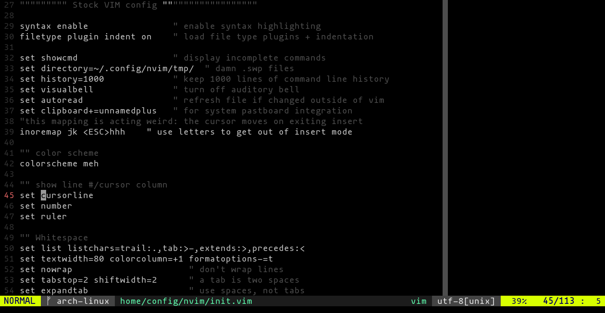

# vim-colors-meh

I've found I prefer running with syntax highlighting *almost* off, but not
quite. I was using [vim-colors-off] for a while, and it was mostly very nice but
unfortunately had some corner cases on dark backgrounds that were annoying.

[vim-colors-off]: https://github.com/pbrisbin/vim-colors-off

This is a colorscheme derived from `vim-colors-off`, but pared down &
focused on a dark background. Basically I just got it to the point where I said
"meh, good enough".

- Dark background, light text, but not super-bright white text.
- Comments/line numbers less prominently colored as gray.
- Highlight current line subtly (when `cursorline` is on).

## Installation

```
$ git clone https://github.com/wfleming/vim-colors-meh ~/.vim/bundle/vim-colors-meh
```

### Vundle

```
Plugin 'wfleming/vim-colors-meh'
```

## Usage

```
:colorscheme meh
```

## Screenshot


